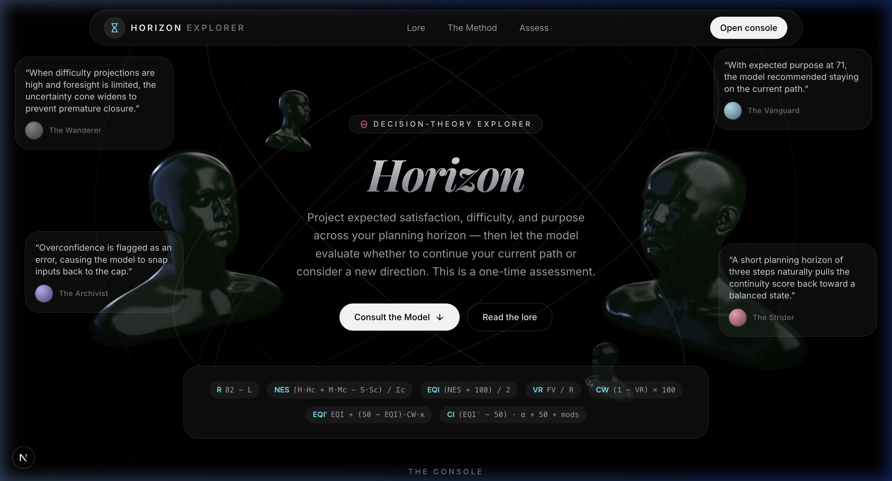
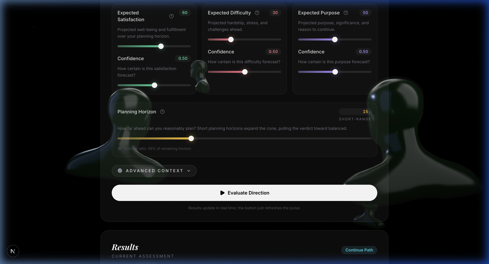
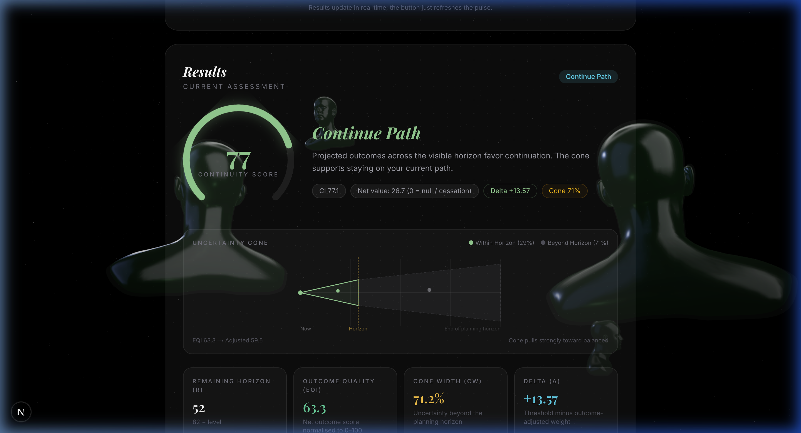
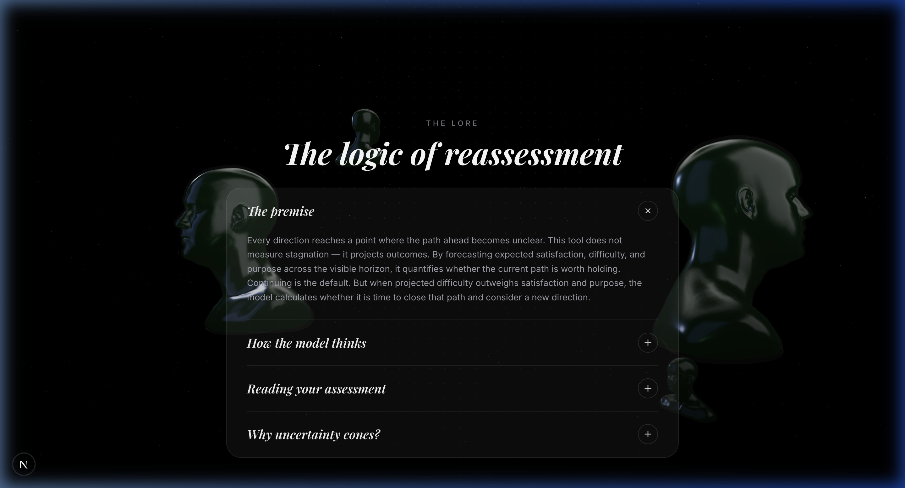

# Horizon — Decision-Theory Explorer

An interactive, professional-grade dashboard for modeling, simulating, and visualizing how projected outcomes and uncertainty horizons influence directional decisions.

Horizon is designed to help analysts, strategic planners, and individuals map the long-term viability of their current trajectories. By weighing satisfaction, difficulty, and purpose against a dynamic planning horizon, Horizon mathematically evaluates whether to persevere along a path or pivot toward a new direction.

---

## Technical Showcase

Below is a visual walk-through of the Horizon dashboard in desktop resolution:

### 1. Hero & Welcome Section
The landing page establishes the philosophical and theoretical context of the explorer, featuring drifting glass cards that reflect real-world feedback on decision-making and forecasting limits.


### 2. The Decision Console
The main control panel where users input their projected satisfaction, difficulty, and purpose, along with respective confidence weights and a set visibility horizon.


### 3. Possibility Cone & Results
A real-time SVG visualization showing the expansion of uncertainty beyond the visibility horizon, accompanied by the calculated Continuity Index and decision verdict.


### 4. Methodology & Theoretical Foundation
The interactive documentation explaining the philosophical lineage (existentialism, decision theory) and the mathematical formulas governing the simulation engine.


---

## Core Features

- **Multi-Dimensional Projections**: Projects satisfaction (expected quality), difficulty (expected obstacles), and purpose (underlying meaning) over a designated trajectory.
- **Epistemic Confidence Weights**: Decoupled confidence sliders ($0.1$ to $0.9$) for each dimension, allowing users to express high certainty in one aspect while remaining highly uncertain about another.
- **Visibility Horizon & Uncertainty Cones**: Simulates the natural decay of predictive foresight. Beyond the user-defined visibility horizon, an SVG possibility cone expands, mathematically pulling outcomes toward a neutral equilibrium to prevent premature termination under high uncertainty.
- **Reflective Spatial Experience**: Implements a responsive 3D gaze-tracking particle field built on React Three Fiber, providing a premium visual layer that reacts dynamically to cursor hover and movement.
- **Dynamic Continuity Index (CI)**: Synthesizes core metrics and resilience modifiers into a unified score from $0$ to $100$ to output one of four mathematical verdicts.

---

## The Mathematical Engine

The calculations powering Horizon are executed in real time within the client-side engine.

### 1. Net Experience Score (NES)
The foundation of the model is the Net Experience Score ($NES$), which computes a confidence-weighted balance between satisfaction, purpose, and difficulty:

$$NES = \frac{H \cdot H_c + M \cdot M_c - S \cdot S_c}{H_c + M_c + S_c}$$

Where:
* $H, S, M \in [0, 100]$ represent Expected Satisfaction, Expected Difficulty, and Expected Purpose, respectively.
* $H_c, S_c, M_c \in [0.1, 0.9]$ represent the user's subjective confidence weights in their forecasts.

### 2. Experience Quality Index (EQI)
To establish a normalized baseline, the $NES$ (which range asymmetrically from roughly $-100$ to $+100$) is scaled to a standard $0$ to $100$ index:

$$EQI = \text{clamp}\left(\frac{NES + 100}{2}, 0, 100\right)$$

### 3. Future Visibility Ratio ($V_R$) and Cone Width ($C_W$)
The remaining path length is defined as $R = 82 - \text{level}$. The Future Visibility Ratio ($V_R$) represents the proportion of the remaining path that is visible:

$$V_R = \text{clamp}\left(\frac{FV}{R}, 0, 1\right)$$

Where $FV \in [1, 50]$ is the user-defined Future Visibility horizon. The uncertainty Cone Width ($C_W$) is the percentage of the remaining path that lies in total forecasting darkness:

$$C_W = (1 - V_R) \times 100$$

### 4. Cone-Adjusted EQI ($EQI_{adj}$)
As uncertainty grows, the model pulls the quality index toward a neutral equilibrium ($50$). This prevents extreme recommendations (such as closing a path) when foresight is limited:

$$EQI_{adj} = EQI + (50 - EQI) \times \frac{C_W}{100} \times \text{CONE\_DAMPING}$$

Where $\text{CONE\_DAMPING} = 0.4$.

### 5. Continuity Index (CI)
The raw index is amplified to fill the full dynamic scale and is then adjusted by optionality, resilience modifiers, and threshold biases:

$$rawCI = (EQI_{adj} - 50) \times \text{AMPLIFY} + 50$$

$$CI = \text{clamp}(rawCI + \text{optionalityBoost} + \text{resilienceBoost} + \text{thresholdBias}, 0, 100)$$

Where:
* $\text{AMPLIFY} = 2.5$ (stretches the typical cone-compressed index).
* $\text{optionalityBoost} = (R \times 0.07) \times 0.3$ (longer horizons add a minor incentive to persist).
* $\text{resilienceBoost} = \frac{RS}{100} \times 4$ (average of resilience metrics: morale, ally support, resources, stamina, versatility, and random events).
* $\text{thresholdBias} \in [-10, 10]$ is a user-configurable offset.

### 6. Decision Verdicts
Based on the final Continuity Index ($CI$) and uncertainty Cone Width ($C_W$), the engine issues one of four verdicts:

* **Wait** ($C_W > 80$): Uncertainty is too high to make an assessment; users are advised to wait for more visibility.
* **Continue Path** ($CI > 70$): Outcomes and confidence support staying on the current trajectory.
* **Balanced** ($30 \le CI \le 70$): Projected benefits and costs weigh equally. Either choice can be justified.
* **Reassessment Recommended** ($CI < 30$): Projected difficulty dominates satisfaction and purpose. Pivot recommended.

---

## Tech Stack

* **Framework**: [Next.js 15](https://nextjs.org/) (App Router, TypeScript)
* **3D Graphics**: [React Three Fiber](https://r3f.docs.pmnd.rs/getting-started/introduction) (R3F) & `@react-three/drei`
* **Animations**: [Framer Motion](https://www.framer.com/motion/)
* **Styling**: Vanilla CSS & [Tailwind CSS](https://tailwindcss.com/)
* **Icons**: [Lucide React](https://lucide.dev/)

---

## Getting Started

### Installation
Clone the repository and install the dependencies:
```bash
npm install
```

### Run Locally
Launch the local development server:
```bash
npm run dev
```
Open [http://localhost:3000](http://localhost:3000) in your browser.

### Build Production
Create a compiled production bundle:
```bash
npm run build
```

---

## Philosophy & Theoretical Heritage

Horizon sits at the intersection of several philosophical and economic schools of thought:
1. **Existentialism (Sartre & Camus)**: Confronting the burden of choice when deciding whether a path continues to provide purpose or if it has entered stagnation.
2. **Decision Theory under Uncertainty**: Integrating epistemic limits and forecasting horizons directly into value equations.
3. **Loss Aversion and Sunk Cost Fallacy**: Acknowledging that humans often continue unviable paths out of inertia, and using mathematical baselines to decouple emotions from choices.

---

## Disclaimer

This is a conceptual application exploring decision theory and subjective experience design. It is not a diagnostic, clinical, or formal risk assessment tool. The outputs should not be used as a substitute for professional counsel or personal judgment in critical life decisions.
