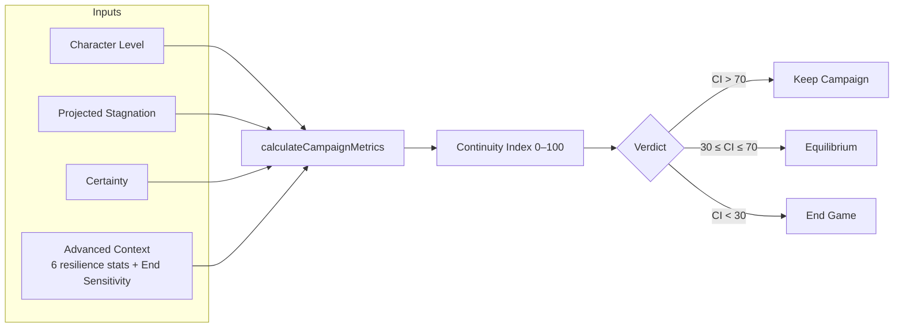
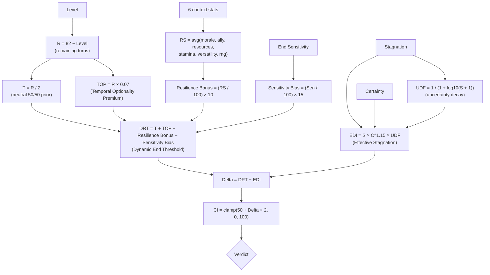
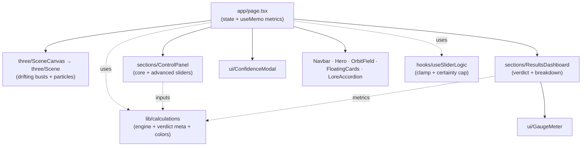
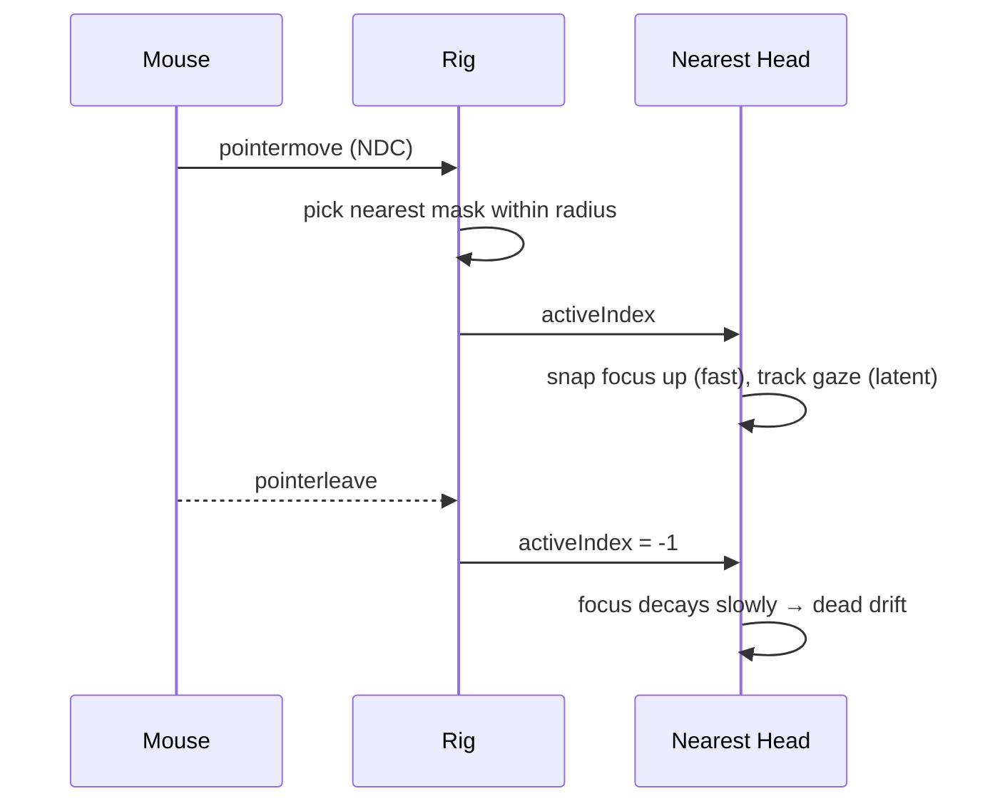

# Chrono Save — Campaign Analytics

> A fictional, in‑world **game‑campaign decision tool**. It weighs the projected
> stagnation of your current build against the upside of **ending the game** for a
> fresh start, and tells you whether to **Keep**, hold at **Equilibrium**, or
> **End Game**.

Built with **Next.js 16 (App Router)** + **TypeScript**, a **React Three Fiber**
scene of drifting greyscale busts, and **Framer Motion** transitions throughout.

## Showcase


<p align="center">
  
  
</p>

---

## Contents

- [Showcase](#showcase)
- [Quick start](#quick-start)
- [How it works](#how-it-works)
- [The mathematical engine](#the-mathematical-engine)
- [Inputs](#inputs)
- [Verdicts](#verdicts)
- [Architecture](#architecture)
- [The 3D scene](#the-3d-scene)
- [Scripts](#scripts)

---

## Quick start

```bash
npm install
npm run dev      # http://localhost:3000
```

> **Note (OneDrive users):** Turbopack's dev HMR can fail with a file‑lock error
> (`os error 32` / `EPERM unlink .next/...`) inside OneDrive‑synced folders. If
> you hit this, use a production build instead, which serves reliably:
>
> ```bash
> npm run build
> npm run start   # http://localhost:3000
> ```

---

## How it works

You calibrate your campaign with three core sliders (plus an optional **Advanced
Context** panel of seven more). The model converts those inputs into a single
**Continuity Index (CI, 0–100)** and a verdict, updated live on every change.



---

## The mathematical engine

All formulas live in [`src/lib/calculations.ts`](src/lib/calculations.ts).
The pipeline:



| Symbol | Name | Formula |
| --- | --- | --- |
| `R` | Remaining turns | `82 − Level` |
| `T` | Neutral threshold | `R / 2` |
| `TOP` | Temporal Optionality Premium | `R × 0.07` |
| `UDF` | Uncertainty Decay Factor | `1 / (1 + log10(S + 1))` |
| `EDI` | Effective Stagnation Weight | `S × C^1.15 × UDF` |
| `RS` | Resilience Score | `avg` of the 6 context stats |
| `DRT` | Dynamic End Threshold | `T + TOP − ResilienceBonus − SensitivityBias` |
| `Δ` | Delta (core decision metric) | `DRT − EDI` |
| `CI` | Continuity Index | `clamp(50 + Δ × 2, 0, 100)` |

Constants: `MAX_LEVEL = 82`, `TOP_MULTIPLIER = 0.07`,
`RESILIENCE_SCALE = 10`, `SENSITIVITY_SCALE = 15`, `CERTAINTY_CAP = 0.90`.

> Higher resilience and higher **End Sensitivity** both lower the Dynamic End
> Threshold, making an **End Game** verdict easier to reach.

---

## Inputs

### Core (always visible)

| Input | Range | Default | Step |
| --- | --- | --- | --- |
| Character Level | 1–100 | 30 | 1 |
| Projected Stagnation Period | 0–80 | 5 | 0.5 |
| Certainty | 0.00–0.90 | 0.50 | 0.01 |

Dragging **Certainty** above `0.90` triggers an epistemic‑humility modal and
snaps the value back to the cap (see
[`src/hooks/useSliderLogic.ts`](src/hooks/useSliderLogic.ts)).

### Advanced Context (collapsible)

| Input | Range | Default | Meaning |
| --- | --- | --- | --- |
| Morale | 0–100 | 60 | Current satisfaction with the campaign |
| Ally Strength | 0–100 | 50 | Social / guild support |
| Resource Reserves | 0–100 | 50 | Gold, items, mana |
| Stamina / Sanity | 0–100 | 70 | Physical / mental condition |
| Build Versatility | 0–100 | 50 | Ability to pivot within the build |
| World RNG Events | 0–100 | 50 | External lucky / unlucky events |
| End Sensitivity | 0–100 | 50 | Personal bias toward ending (Conservative → Aggressive) |

The defaults yield **CI ≈ 80.8 → Keep Campaign** on first load.

---

## Verdicts

| Verdict | Band | Meaning |
| --- | --- | --- |
| **Keep Campaign** | `CI > 70` | Current build is the stronger expected path. |
| **Equilibrium** | `30 ≤ CI ≤ 70` | Balanced — either choice can be justified. |
| **End Game** | `CI < 30` | Projected stagnation overtakes the buffer; a new campaign is the safer bet. |

The results dashboard renders the verdict, a circular **Continuity Index** gauge
(red → yellow → cyan), an **Uncertainty Buffer** bar, and a breakdown of `R`,
`EDI`, `DRT`, `Δ`, and the **Resilience Score**.

---

## Architecture



Key files:

- `src/lib/calculations.ts` — the engine, `Verdict` type, `VERDICT_META`, and `getContinuityColor`.
- `src/hooks/useSliderLogic.ts` — integer/decimal clamps and the Certainty cap.
- `src/components/sections/ControlPanel.tsx` — all sliders + Advanced accordion + Reset.
- `src/components/sections/ResultsDashboard.tsx` — verdict, gauge, buffer bar, breakdown.
- `src/components/ui/GaugeMeter.tsx` — animated circular SVG gauge.
- `src/components/three/Scene.tsx` — R3F scene, particles, cursor‑following busts.

---

## The 3D scene

Four greyscale busts drift in space. The mask **nearest the cursor** snaps its
attention toward the pointer and tracks it with a slight organic latency, then
slowly relaxes back to its neutral, expressionless drift when the cursor leaves.
Because the canvas is `pointer-events-none`, pointer position is captured via
`window` listeners and fed into the scene as normalized device coordinates.



---

## Scripts

| Command | Description |
| --- | --- |
| `npm run dev` | Start the dev server (Turbopack). |
| `npm run build` | Production build. |
| `npm run start` | Serve the production build. |
| `npm run lint` | ESLint. |
| `npm run format` | Prettier write. |

---

*Chrono Save is a fictional campaign decision tool; all figures are in‑world game
mechanics. Head sculpture: Lee Perry‑Smith (Infinite‑Realities) · CC BY 3.0.*
