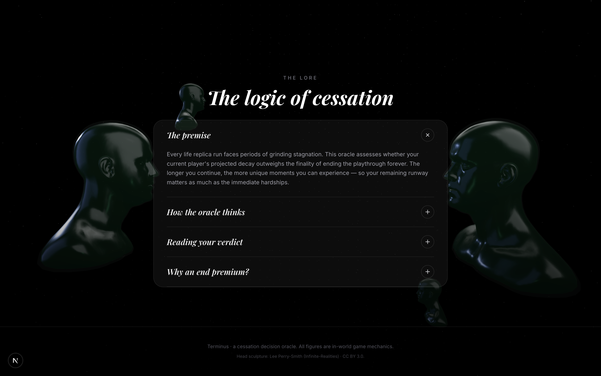
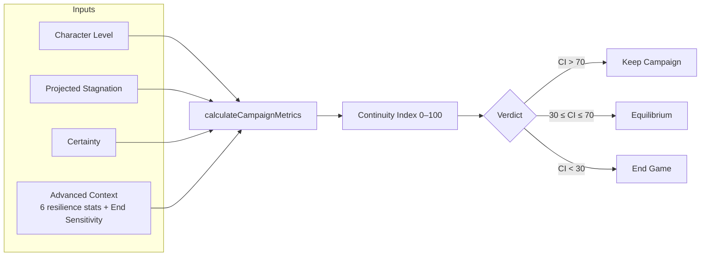
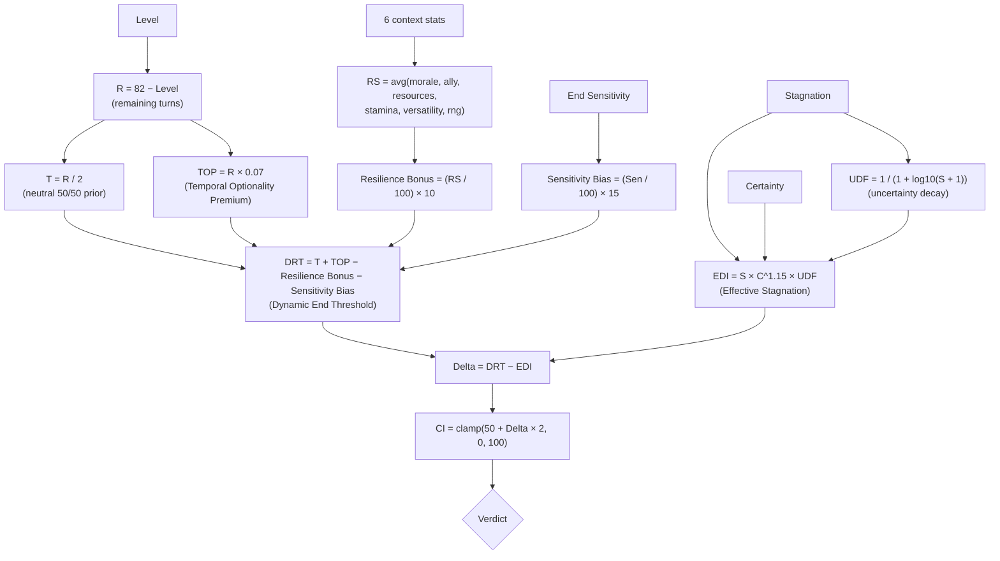
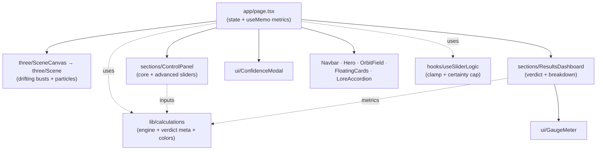
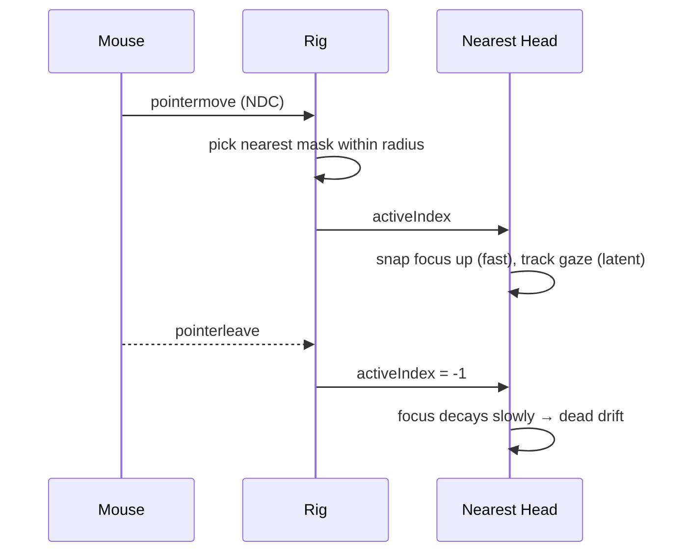

# Terminus — Campaign Cessation Oracle

> You are lingering in the late hours of a dying run. The grind is heavy, the build has stagnated, and the progress has ground to a halt. 
>
> But this game is only played once. There are no restarts. There is no fresh start. If you choose to end the campaign, the window closes forever and your journey is permanently over. Do you persist in the creeping decay, or do you sever the thread?
>
> **Terminus** is the Cessation Oracle. It weighs the projected stagnation of your current build against the permanent finality of ending the game, deciding whether you should **Keep** holding the line, wait at **Equilibrium**, or choose **End Game**.

Built with **Next.js 16 (App Router)** + **TypeScript**, a **React Three Fiber** scene of drifting greyscale busts that watch your decisions, and **Framer Motion** transitions throughout.

---

## Showcase


<p align="center">
  
  
</p>

---

## Contents

- [Showcase](#showcase)
- [Quick start](#quick-start)
- [The Lore of Cessation](#the-lore-of-cessation)
- [The Mathematical Engine](#the-mathematical-engine)
- [Inputs for Calibration](#inputs-for-calibration)
- [Verdicts of the Oracle](#verdicts-of-the-oracle)
- [Architecture](#architecture)
- [The 3D Watchers](#the-3d-watchers)
- [Scripts](#scripts)

---

## Quick start

```bash
npm install
npm run dev      # http://localhost:3000
```

> **Note (OneDrive users):** Turbopack's dev HMR can fail with a file‑lock error
> (`os error 32` / `EPERM unlink .next/...`) inside OneDrive‑synced folders. If
> you hit this, use a production build instead, which serves reliably:
>
> ```bash
> npm run build
> npm run start   # http://localhost:3000
> ```

---

## The Lore of Cessation

Every single-playthrough campaign reaches a point of friction. The oracle quantifies this dilemma:



---

## The Mathematical Engine

The equations governing your finality are defined in [`src/lib/calculations.ts`](src/lib/calculations.ts). They weigh persistence against termination:



| Symbol | Name | Formula | Meaning in the Void |
| --- | --- | --- | --- |
| `R` | Remaining turns | `82 − Level` | The runway before natural end game occurs. |
| `T` | Neutral threshold | `R / 2` | The neutral point where persistence and letting go are equal. |
| `TOP` | Temporal Optionality Premium | `R × 0.07` | The value of holding on (longer runs allow more lucky events). |
| `UDF` | Uncertainty Decay Factor | `1 / (1 + log10(S + 1))` | Natural decay of your forecasts over extended stagnation. |
| `EDI` | Effective Stagnation Weight | `S × C^1.15 × UDF` | The felt weight of your build's decay. |
| `RS` | Resilience Score | `avg` of the 6 context stats | How well you are supported in resisting termination. |
| `DRT` | Dynamic End Threshold | `T + TOP − ResilienceBonus − SensitivityBias` | The point at which the decay becomes statistically terminal. |
| `Δ` | Delta (core metric) | `DRT − EDI` | The mathematical gap between staying and terminating. |
| `CI` | Continuity Index | `clamp(50 + Δ × 2, 0, 100)` | The overall rating of your run's survivability. |

Constants: `MAX_LEVEL = 82`, `TOP_MULTIPLIER = 0.07`, `RESILIENCE_SCALE = 10`, `SENSITIVITY_SCALE = 15`, `CERTAINTY_CAP = 0.90`.

*Note: High resilience and higher End Sensitivity both lower the Dynamic End Threshold, shifting the balance closer to the permanent finality of an End Game verdict.*

---

## Inputs for Calibration

### Core Sliders (Always Visible)

| Input | Range | Default | Impact on the Oracle |
| --- | --- | --- | --- |
| Character Level | 1–100 | 30 | Higher levels shrink the remaining turns, reducing optionality. |
| Projected Stagnation Period | 0–80 | 5 | The length of time you expect to wander in the build's desert. |
| Certainty | 0.00–0.90 | 0.50 | Dragging this above `0.90` triggers an epistemic-humility modal and snaps you back to the cap. Absolute certainty is a illusion. |

### Advanced Context (Collapsible)

| Input | Range | Default | Meaning |
| --- | --- | --- | --- |
| Morale | 0–100 | 60 | Your character's current will to keep pushing. |
| Ally Strength | 0–100 | 50 | Social, guild, or external support to sustain the run. |
| Resource Reserves | 0–100 | 50 | Gold, inventory items, and stockpiled assets. |
| Stamina / Sanity | 0–100 | 70 | Your physical and mental condition. |
| Build Versatility | 0–100 | 50 | The capacity to adapt your build without ending the run. |
| World RNG Events | 0–100 | 50 | The volatility of external lucky/unlucky incidents. |
| End Sensitivity | 0–100 | 50 | Your personal bias toward finality (Conservative $\to$ Aggressive). |

---

## Verdicts of the Oracle

| Verdict | Continuity Index | Meaning |
| --- | --- | --- |
| **Keep Campaign** | `CI > 70` | Persist. The current build remains your strongest path. Keep going. |
| **Equilibrium** | `30 ≤ CI ≤ 70` | A balanced state. Either choice can be justified. Choose carefully. |
| **End Game** | `CI < 30` | The decay has won. Stagnation exceeds your optionality. Pull the plug and accept the end. |

---

## Architecture



Core Modules:
* `src/lib/calculations.ts` — The mathematical engine, types, and color interpolations.
* `src/hooks/useSliderLogic.ts` — Boundary clamps and the certainty-cap validation.
* `src/components/sections/ControlPanel.tsx` — Calibrating sliders and advanced context.
* `src/components/sections/ResultsDashboard.tsx` — Live verdicts, gauge meter, and stat card breakdown.
* `src/components/ui/GaugeMeter.tsx` — SVG circle animations driven by spring physics.
* `src/components/three/Scene.tsx` — React Three Fiber scene containing the gaze-tracking busts.

---

## The 3D Watchers

Four greyscale busts drift in the dark background. They are the silent watchers of your decision.
The bust **nearest your cursor** will snap its attention to follow your movement, tracking you with slight latency. Once your cursor leaves or goes idle, they relax back into their expressionless, infinite drift. 



---

## Scripts

| Command | Description |
| --- | --- |
| `npm run dev` | Start the local oracle console (Turbopack). |
| `npm run build` | Compile the static production build. |
| `npm run start` | Serve the production build. |
| `npm run lint` | Run ESLint check. |
| `npm run format` | Run Prettier code formatting. |

---

*Terminus is an in-universe cessation decision oracle; all figures represent campaign design mechanics. Head sculpture asset: Lee Perry‑Smith (Infinite‑Realities) · CC BY 3.0.*
